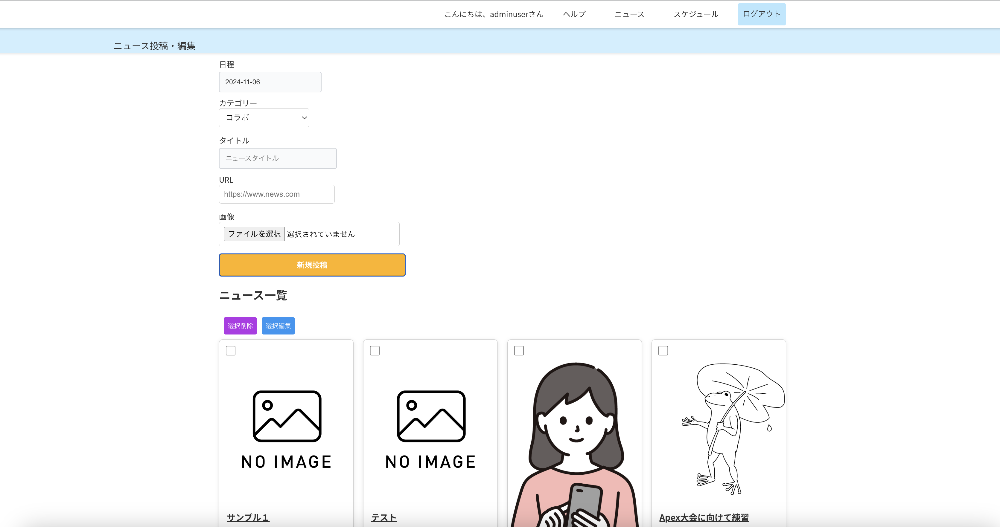
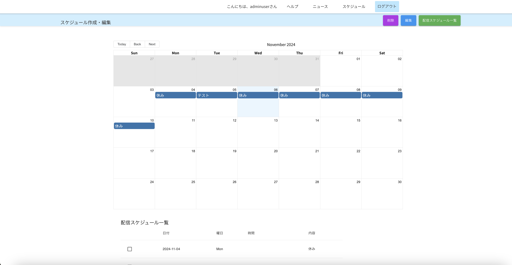
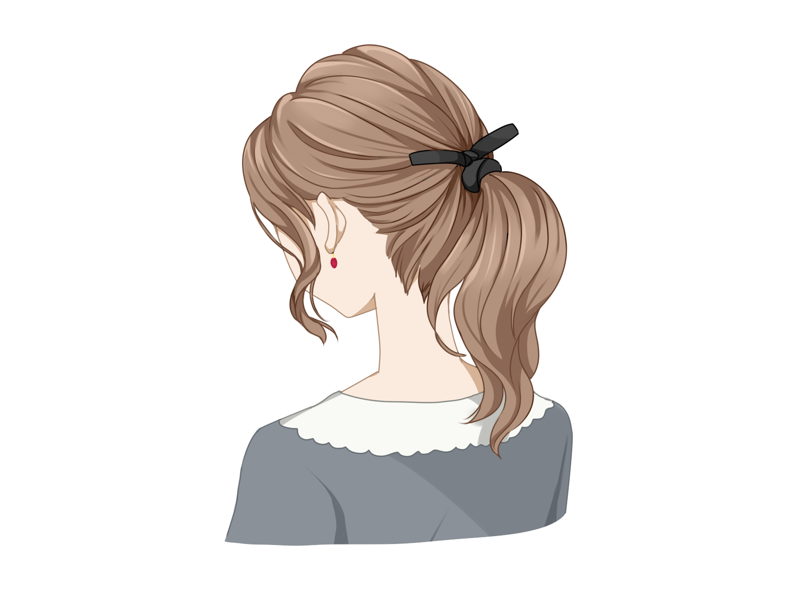

# サイト管理画面α版(TestAppRails)

## 0.はじめに  
このリポジトリは転職用のポートフォリオとして公開しております。2024年4月より未経験からWebエンジニアを目指しており、  
知人からweb開発のオファーをいただき、独学でやりながら現在も開発に奮闘中です。拙い所はまだたくさんありますが、  
エンジニアリングを通したものづくりがとても楽しく、それに打ち込む集中力が今後のキャリアにも活かせられるよう精進します。    
## 1.概要・背景  
本プロジェクトは、個人ストリーマー向けのオリジナルサイトパッケージ開発・検証の一環になります。  
背景として知人から **「オリジナルTシャツを作る感覚で手軽にサイトが作れるか」** の相談を今年の5月に受けたところから始まりました。  
ここで指す個人ストリーマーとは、事務所に属さず、「趣味又は副業の範囲で個人的に配信をしている人」のことです。   
自己研鑽の後押しにもなればと思い、本プロジェクトに参画しました。

プロジェクトメンバー&nbsp;&nbsp;&nbsp;&nbsp;2名   
・私（フロントエンド、バックエンド、技術開発担当）  
・知人（ビジネス設計、マーケティング担当）  

さて、「手軽に」という意味ではWordPressのようなCMSが思いつきますが、そういう便利なものがあったとしても使う人の目的や状況に  
よっては懸念点が挙げられます。

## 今回のモデルケース

 
## 20代後半、女性、新卒３年目、Youtube配信者として半年、登録者数は800人程度で固定ファンが増え、収益化目前。  
悩み事、課題：収益化に向けて配信頻度をあげているが、登録者数の伸びが鈍化、グッズを作ってみたが売れず、アピールをしたいが複数回もグッズのポストをするのは卑しい感じがして抵抗がある。
情報発信をしたいが、配信時間が他と被ると告知ポストが流れていってしまってる。もっとファンを囲い込みたいと思っている。  
・サーバーやドメイン設定、WordPressの使い方など技術面でつまづく  
・そもそもサイト作りに時間やお金をかける余裕がない    
「画像差し替えやテンプレート変更だけの更新が可能か」、「個人ストリーマーが欲しいと思える機能が現実的に作れるか」  

This README would normally document whatever steps are necessary to get the
application up and running.

Things you may want to cover:

* Ruby version

* System dependencies

* Configuration

* Database creation

* Database initialization

* How to run the test suite

* Services (job queues, cache servers, search engines, etc.)

* Deployment instructions

* ...
