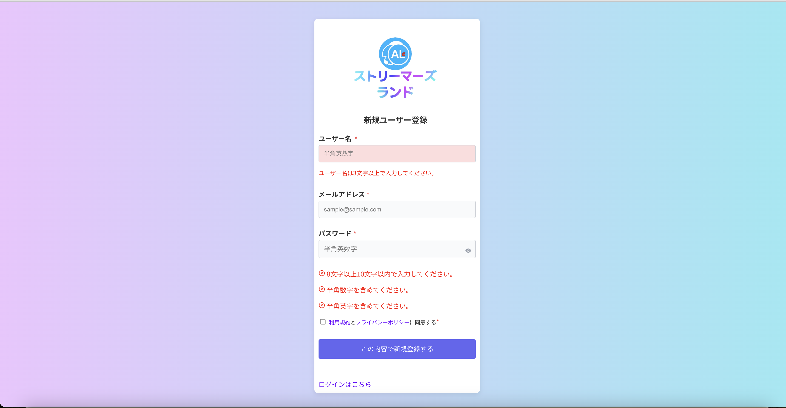
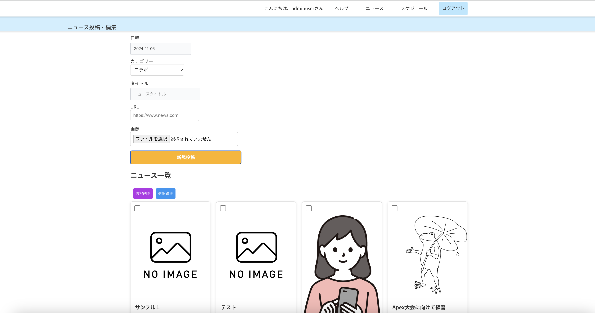
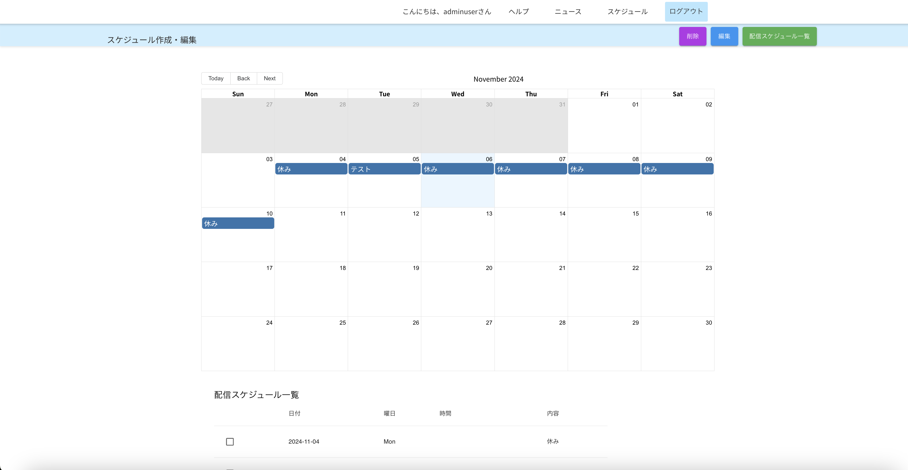

# サイト管理画面α版(Ruby on Rails)  
  
  
  

## 📌 １分で読めるプロジェクト概要・背景  
本プロジェクトは、個人ストリーマー向けに、ファン向けの情報発信が簡単にできるオリジナルサイトのパッケージの開発・検証を目的としています。知人から、「個人ストリーマーが手軽にスケジュールやグッズなどのニュースを積極的に発信できる専用サイトを提供できるのか」という相談を受けました。知人はかつて個人で配信活動を行っており、ファンへ情報を伝える難しさに直面しました。配信活動を引退した彼は、同じ悩みを抱える個人ストリーマーの支援を目的としたサービスができないかと考え、このプロジェクトに私を誘ってくれました。私自身も相談を受けた当時、未経験からエンジニアへのキャリアチェンジを考えていたため、開発経験を積むことを目的に参加を決意しました。

`※「個人ストリーマー」とは、事務所に所属せず、個人で配信活動を行っている方々を指します。`  

## 🐈　簡単な自己紹介  

ここではYunuと申します。開発は今回が初めてで、2024年4月より未経験からWebエンジニアを目指しています。５月に知人からweb開発の提案があり、独学で学びながら現在も開発に奮闘中です。拙い所はまだたくさんありますが、エンジニアリングを通したものづくりがとても楽しく、今回の開発経験が今後のキャリアにも活かせられるよう精進します。  

## 📢 テスト時のご案内  
当アプリは転職用ポートフォリオの目的で一時的にデプロイして公開しています。  
また今回の開発ではフロントエンドとバックエンドを両方やりましたが、フロントエンドのリポジトリは[こちら](こちら)からご確認ください。  

確認済の環境：Google Crome,Safari  
レスポンシブデザイン：iPhone 8,iPhone SE,iPhone XR,iPhone 12 Pro,iPhone 14 Pro Max(androidなど他デバイスは順次対応）  

現段階では以下の機能に限ってご利用いただけます。  
 
#### ✅ 使用可能な機能
 * ログイン・ログアウト
 * スケジュール投稿・編集・削除  
 * ニュース投稿・編集・削除

#### ⛔ 停止中の機能  
 * ユーザー新規登録の送信  
 * パスワード再発行の送信  
 * お問い合わせフォームの送信

 🙇‍♀️　停止理由：本番環境における自動送信メール設定（主にsmptエラー）の確認作業がまだ続いているため。  
詳細は [Railsを用いたバックエンドの機能と課題へのアプローチ](#railsを用いたバックエンドの機能と課題へのアプローチ)に書きました。

 ## 🌐 URL  
https://alc-streamersland.com/login  【ログイン画面】
ユーザー名 `adminuser` パスワード `test1234`  をログイン画面でご入力ください。

https://alc-streamersland.com/custom-page  【テンプレートサイト（仮）】  管理画面でニュースとスケジュールの投稿内容がこちらのサイトに連動して飛ぶようになっています。  

 ## ⚙️ 採用した技術

| 技術                  | バージョン | 役割／特徴／選定理由 |
| --------------------- | ---------- | -------------------- |
| **Ruby on Rails**     | 7.1.3.4    | バックエンドフレームワークとして使用。開発効率が高く、豊富なライブラリとActiveRecordでのデータベース操作が容易なため。 |
| **React**             | 18.0       | フロントエンドライブラリとして使用。コンポーネントベースで再利用性が高く、ユーザーインタラクションが多い管理画面に適しているため。 |
| **PostgreSQL**        | -          | Herokuでのデフォルトのデータベースとして使用。Railsとの相性も良く、デプロイが容易で、現在の構成で問題なく動作しています。 |
| **Heroku**            | -          | バックエンドサーバーのデプロイに使用。迅速なデプロイと管理ができ、試作品の公開やテスト環境の提供に適していたため。 |
| **Sakura Rental Server** | -       | フロントエンドサーバーのデプロイに使用。国内向けの低遅延な運用が可能なため採用しました。 |

## ⚙️ 試してみたが採用しなかった技術

| 技術                  | バージョン | 備考 |
| --------------------- | ---------- | ---- |
| **Docker**            | -          | 開発環境の統一を目指して試用しましたが、今回のプロジェクトでは複雑化を避けるために見送りました。 |
| **AWS EC2**           | -          | Railsとの互換性や将来的な負荷増加を考慮して検討しましたが、今回は導入のしやすさを優先し、HerokuとSakura Rental Serveを採用しました。 |
| **MySQL**             | 8.0        | 開発初期に検討しましたが、Heroku上でのPostgreSQLの使用が容易だったため、最終的にPostgreSQLを選定しました。今後の状況に合わせて再使用したいと思っています。 |
| **PHP・Laravel**             | 8.3/10        | 当初、API実装のためにPHPとLaravelを試用しましたが、Reactとの連携や設定管理の複雑さから開発が進みにくいと感じ、最終的にRailsに切り替えました。Railsの一貫したフレームワークや豊富な学習リソースが学習・実装をスムーズにしたため、Railsを採用することにしました。 |  

## 🛠️　プロジェクトメンバー  

| メンバー | 役割 |
| -------- | ---- |
| 私 （Yunu)      | フロントエンド、バックエンド、技術開発担当 |
| 知人（Hiro)     | ビジネス設計、マーケティング担当、元配信者 |

## 👀 コンセプト及び検証内容

顧客側の目標：少ない手間で、ニュースやスケジュールの投稿・更新ができる「手軽だけど高品質な専用サイト」を持てるか。  

開発者側の目標：パッケージ開発時には手がかかっても、開発完了後では顧客毎に画像の差し替えやテンプレートデザインの変更だけで納品できるようにし、ローンチ後の負担を最小限に抑え、利益を創出できるか。   

## 👤 今回の想定するターゲット像

 
___
20代後半、女性、新卒３年目、YouTube配信者として半年、登録者数は800人程度で固定ファンが増え、収益化目前。 
        
【悩み事、課題】収益化に向けて配信頻度をあげているが、登録者数の伸びが鈍化。グッズを作ってみたが売れず、グッズのアピールをしたいが複数回ポストは抵抗がある。  
【現状の対策】SNS投稿で同じ投稿を複数回やる、Discordなどのコミュニティ運営をしている（0円/年)  
【希望】チャンネルのために何かを投資するなら予算は1万円くらいまでなら良い、収益化まであと200人、もっとファンを囲い込みたい。 
___

# Railsを用いたバックエンドの機能と課題へのアプローチ  
### 1. 自動メール送信機能  

実装した自動メール送信機能では、ユーザー登録や問い合わせに対して、確認メールを即座に送信することを目指しました。この機能によりユーザーがスムーズな体験を得られるようにし、特にActiveMailerとSMTPサーバーを使った安全な送信方法を採用したいと思っています。  

ぶつかった壁としては、SMTP設定やCORS対応において本番環境でメール送信が失敗することがありました。原因の調査を行い、SMTPホスト名やポート設定を詳細に検証しましたが、特定の環境での設定の相違が原因であることが判明。  
具体的にはSMTPサーバーのホスト名とポート番号、および証明書の検証オプションでした。特に、SakuraレンタルサーバーでのSMTP設定を行う際、デフォルトで提供されたホスト名ではなく、初期ドメインを使用する必要がありました。それでもまた、証明書の検証によるエラーが発生したため、設定にopenssl_verify_mode: 'none'を追加してみるも証明書エラーは回避できず難航中。    

### 2. スケジュール管理の自動更新  

日曜日深夜0時を過ぎると次週スケジュールに自動切り替えする機能を実装し、手動で過去のスケジュールを削除する手間を軽減しました。この自動更新のロジックは、Railsバックエンドで定期的に実行され、ユーザーが意識せずに最新のスケジュールにアクセスできるようになっています。 
   
### 課題に対するアプローチ　　
自動更新のタイミング設定がサーバーによって異なることがあり、予定の反映が遅れるケースが発生。これに対し、ジョブスケジューリングの調整を行い、時間指定による定期更新を正確にするようにしました。また、今後の安定運用に向け、他のスケジューラーツールの導入も検討しています。  

### 3. 画像管理の調整  

RailsのActiveStorageを用いてニュースやスケジュールに画像を添付し、フロントエンドに表示する機能を作成しました。特に、画像が添付されていない場合にはデフォルト画像を設定することで、視覚的な一貫性を持たせています。  

### 課題に対するアプローチ  　　
画像のアップロード時に、正しくデータベースに反映されないケースが発生。画像が反映されない原因を調査し、ActiveStorageの設定とファイルパスを細かく確認。さらに、今後の対応としては、S3などの外部ストレージとの連携も視野に入れ、安定した画像の取り扱いを目指しています。  

### 4. APIを介したReactとの連携

フロントエンドのReactアプリケーションとRailsのAPI連携により、リアルタイムでのデータ反映を実現しました。ログイン情報、スケジュール、ニュースといった重要データのやり取りをスムーズに行い、ユーザーの操作が即座に反映されるUI/UXを提供しています。  

### 課題に対するアプローチ  
API経由でデータを送受信する際に、CORSエラーが発生。これに対し、Railsのcors.rbファイルで設定を調整し、CORSリクエストの許可範囲を制限することで安全性を確保しました。これにより、外部からのアクセスに対しても適切な管理ができるようになっています。 
   
 

## ✍️ 今後に向けて  
現在、いくつかの技術的な課題が残っています。   

### 課題  
 
* ページの読み込み速度に改善の余地があり、特に画像や動画コンテンツが多いページでユーザーエクスペリエンスを損なっている。
* バリデーション処理がクライアント側とサーバー側で冗長に実装されており、メンテナンス性が低い。
* セキュリティ面での課題があり、ログアウト後もセッションが保持され、アクセスが可能になってしまう場合がある。
* バックエンドのAPIエンドポイントが増えるにつれて、CORSエラーの管理が複雑になっている。

### 今後の施策  
* 画像の最適化やLazy Loadの導入、キャッシュ機能の活用により、ページの読み込み速度を向上させる。
* バリデーションを一元管理し、フロントエンドとバックエンド間で共通化することで、コードの重複を削減し、保守性を向上させる。
* セッション管理を強化し、ログアウト時にキャッシュクリアやローカルストレージの削除を行う処理を追加する。また、トークンの有効期限設定や自動セッションタイムアウトを導入する。
* CORS設定を見直し、エンドポイントごとに適切なポリシーを適用する。また、APIゲートウェイやリバースプロキシを導入し、API管理をスムーズに行えるようにする。

## 👀 総括  
ここまで読んでくださりありがとうございました。 
開発を進めれば進めるほど、浮き彫りになってくる様々な課題を一つ一つ解消していく過程も含めて楽しめました。まずは実際に物が作れるかどうかが自身の課題であったため、そこをまずクリアできたことは少し安心しています。今後はセキュリティやサーバー面の知識もしっかり学び、資格も取ってWeb開発で幅広く活躍できるエンジニアとして成長していきたいです。  

